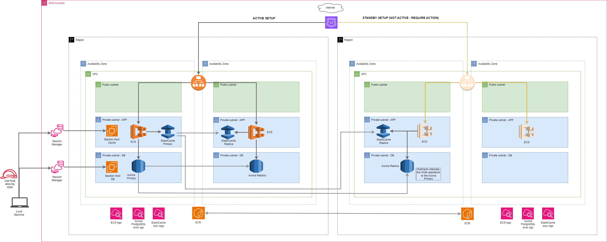

<p align="center"><a href="https://kutt.it" title="kutt.it"></a></p>

# Kutt.it

**Kutt** is a modern URL shortener with support for custom domains. Shorten URLs, manage your links and view the click rate statistics.

_Contributions and bug reports are welcome._

[https://kutt.it](https://kutt.it)

[](https://travis-ci.org/thedevs-network/kutt)
[](https://github.com/thedevs-network/kutt/#contributing)
[](https://github.com/thedevs-network/kutt/blob/develop/LICENSE)
[](https://twitter.com/intent/tweet?text=Wow:&url=https%3A%2F%2Fgithub.com%2Fthedevs-network%2Fkutt%2F)

## Table of Contents

- [Key Features](#key-features)
- [Stack](#stack)
- [Setup](#setup)
- [Browser Extensions](#browser-extensions)
- [API](#api)
- [Integrations](#integrations)
- [3rd Party Packages](#3rd-party-packages)
- [Donate](#donate)
- [Contributing](#contributing)

## Key Features

- Free and open source.
- Custom domain support.
- Custom URLs for shortened links
- Set password for links.
- Set description for links.
- Expiration time for links.
- Private statistics for shortened URLs.
- View, edit, delete and manage your links.
- Admin account to view, delete and ban links.
- Ability to disable registration and anonymous link creation for private use.
- RESTful API.

## Stack

- Node (Web server)
- Express (Web server framework)
- Passport (Authentication)
- React (UI library)
- Next (Universal/server-side rendered React)
- Easy Peasy (State management)
- styled-components (CSS styling solution library)
- Recharts (Chart library)
- PostgreSQL (database)
- Redis (Cache layer)

## Setup

### Manual

You need to have [Node.js](https://nodejs.org/), [PostgreSQL](https://www.postgresql.org/) and [Redis](https://redis.io/) installed.

1. Clone this repository or [download the latest zip](https://github.com/thedevs-network/kutt/releases).
2. Copy `.example.env` to `.env` and fill it properly ([see below](#configuration)).
3. Install dependencies: `npm install`.
4. Run for development: `npm run dev`.
5. Run for production: `npm run build` then `npm start`.

### Docker

1. Download the [`docker-compose.yml`](https://raw.githubusercontent.com/thedevs-network/kutt/develop/docker-compose.yml) and the [`.docker.env`](https://raw.githubusercontent.com/thedevs-network/kutt/develop/.docker.env) files.
2. Rename `.docker.env` to `.env` and fill it properly ([see below](#configuration)).
3. To execute Kutt you simply have to run `docker-compose up -d` command and then the app should be ready on port "3000".

The `docker-compose.yml` uses the official kutt docker image available on [Docker Hub](https://hub.docker.com/r/kutt/kutt).

### Configuration

For the minimal configuration the following settings have to be changed in the `.env`-file:

- **DEFAULT_DOMAIN**: The domain of your kutt instance
- **DB_**: The DB credentials (when you use docker-compose you can skip these)
- **ADMIN_EMAILS**: A comma-separated list of the administrator-accounts
- **RECAPTCHA_**: Enter your credentials to use reCaptchas or delete this setting if you don't want to use it
- **MAIL_**: Enter the SMTP-server's credentials (The experience shows SSL works better than STARTTLS; The mail config is required to easily create accounts, see [this comment](https://github.com/thedevs-network/kutt/issues/269#issuecomment-628604256) how it can be done manually)
- **REPORT_EMAIL**: Kutt offers a form to report malicious links which are sent to this mail-address

## Browser Extensions

Download Kutt's extension for web browsers via below links. You can also find the source code on [kutt-extension](https://github.com/abhijithvijayan/kutt-extension).

- [Chrome](https://chrome.google.com/webstore/detail/kutt/pklakpjfiegjacoppcodencchehlfnpd)
- [Firefox](https://addons.mozilla.org/en-US/firefox/addon/kutt/)

## API

Visit API v2 documentation on [docs.kutt.it](https://docs.kutt.it)

## Integrations

### ShareX

You can use Kutt as your default URL shortener in [ShareX](https://getsharex.com/). If you host your custom instance of Kutt, refer to [ShareX wiki](https://github.com/thedevs-network/kutt/wiki/ShareX) on how to setup.

### Alfred Workflow

Download Kutt's official workflow for [Alfred](https://www.alfredapp.com/) app from [alfred-kutt](https://github.com/thedevs-network/alfred-kutt) repository.

## 3rd Party packages
| Language   | Link                                                                              | Description                                        |
| ---------- | --------------------------------------------------------------------------------- | -------------------------------------------------- |
| C# (.NET)  | [KuttSharp](https://github.com/0xaryan/KuttSharp)                                 | .NET package for Kutt.it url shortener             |
| C# (.NET)  | [Kutt.NET](https://github.com/AlphaNecron/Kutt.NET)                               | ✂️🔗 C# API Wrapper for Kutt
| Python     | [kutt-cli](https://github.com/RealAmirali/kutt-cli)                               | Command-line client for Kutt written in Python     |
| Ruby       | [kutt.rb](https://github.com/RealAmirali/kutt.rb)                                 | Kutt library written in Ruby                       |
| Rust       | [urlshortener](https://github.com/vityafx/urlshortener-rs)                        | URL shortener library written in Rust              |
| Rust       | [kutt-rs](https://github.com/robatipoor/kutt-rs)                                  | Command line tool written in Rust                  |
| Node.js    | [node-kutt](https://github.com/ardalanamini/node-kutt)                            | Node.js client for Kutt.it url shortener           |
| JavaScript | [kutt-vscode](https://github.com/mehrad77/kutt-vscode)                            | Visual Studio Code extension for Kutt              |
| Java       | [kutt-desktop](https://github.com/cipher812/kutt-desktop)                         | A Cross platform Java desktop application for Kutt |
| Go         | [kutt-go](https://github.com/raahii/kutt-go)                                      | Go client for Kutt.it url shortener                |
| BASH       | [GitHub Gist](https://gist.github.com/hashworks/6d6e4eae8984a5018f7692a796d570b4) | Simple BASH function to access the API             |
| BASH       | [url-shortener](https://git.tim-peters.org/Tim/url-shortener)                     | Simple BASH script with GUI                        |

## Donate


Kutt is free of charge and free of ads. Help us keep our servers running and motivate us to work on this project by donating to our Bitcoin wallet:

```
1P89WxNTinKxxDQ4FmC4jis3KUdfA9fLJB
```

## Contributing

Pull requests are welcome. You'll probably find lots of improvements to be made.

Open issues for feedback, requesting features, reporting bugs or discussing ideas.

Special thanks to [Thomas](https://github.com/trgwii) and [Muthu](https://github.com/MKRhere). Logo design by [Muthu](https://github.com/MKRhere).

## Infrastructure



### Infrastructure Architecture Documentation

This architecture supports the Kutt app with high availability, scalability, and security. It is distributed across multiple regions and implements the Pilot Light Disaster Recovery(DR) strategy.

The Pilot Light is one of the cost effective Disaster Recovery strategies and it maintains a minimal version of an envrionment in a secondary region (in our case we have a Primary region `eu-west-1` and a Secondary region `us-east-1`). This strategy supports only the critical components of the application (database, cache, load balancer, networking settings) and the non-critical components, like the compute power, ARE pre-defined but NOT deployed and they can be quickly launched when required.

Here are the characteristic of the Pilot Light startegy:
- **Cost**: moderate (small compute and high db and cache )
- **RTO**: depends on the setup - minutes to hours
- **RPO**: depends on the replication model 
    - daily backup = 1 day RPO
    - hourly backup = 1 hour RPO
    - real-time replication = seconds to minutes RPO

In our setup we have Global replication for our resources (ECR, Aurora Global Database, ElastiCache Global Datastore) and already predefined compute power in the secondary region which needs to be uncommented and deployed, so we have the following metrics for the Pilot Light strategy:
- **RTO**: minutes
- **RPO**: seconds (we have asynchronous replication for the database and the cache)

### Architecture Components
We have the following components in our architecture:
- **Route 53**: Manages DNS routing for the app. A hosted zone in Route53 allows access to the application - we have a Primary and a Secondary domain failover strategy.
- **Application Load Balancer (ALB)**: Distributes incoming traffic across ECS tasks to ensure high availability and scalability.
- **Amazon Elastic Container Service (ECS)**: Runs containerized applications in a private subnet across two Availability Zones (eu-west-1a and eu-west-1b). ECS ensures that the application is isolated in a secure environment.
- **Amazon ElastiCache (Redis) Global Datastore**: Provides in-memory caching to improve application response times. Redis is hosted in the same private subnet (app subnet) as the ECS tasks, allowing for low-latency access.
- **Amazon Aurora PostgreSQL Global Database**: A managed database that serves as the primary data store for the application. Aurora is deployed in a separate private subnet (db subnet) across two Availability Zones (eu-west-1a and eu-west-1b) to ensure durability and availability.
- **Elastic Container Registry (ECR) Global Replication**: Stores and manages container images for the application.
- **CloudWatch**: Collects and monitors logs for each layer - application, database, cache
- **Bastion Host with AWS Session Manager**: Deployed in a private subnet to allow secure access to resources that do not have public endpoints. It has integration with AWS Session Manager which eliminates the need for any kind of keys or Jump Host in a public subnet.

### Infrastructure Code and Deployment
The Terraform codebase for deploying the infrastructure resides in the `infrastructure` folder at the root level of the repository. The infrastructure is modularized as follows:

- **Modules**: Each resource (e.g., ECS, Load Balancer, RDS) has a dedicated module under `infrastructure/modules` folder. These modules are referenced in the main Terraform configuration file (main.tf) within the infrastructure folder.

- **Helper Scripts**: The scripts folder contains scripts to streamline the deployment process. Here’s a breakdown of the main scripts:

    - `assume-role.sh`: Assumes the required IAM role to provision Terraform resources, allowing secure and scoped access to AWS.

    - `terraform-pre-deploy-plan.sh` and `terraform-pre-deploy-apply.sh`: Creates ECR repositories as a prerequisite for deploying ECS tasks. In an automated pipeline, this script would run prior to the Terraform deployment.

    - `ecr-build-and-push.sh`: Builds the Docker image from the app's Dockerfile and pushes it to the ECR repository created in the previous step. This script typically runs between the pre-deployment and Terraform steps.

    

    - `terraform-<step>.sh`: Helper scripts for each stage of the Terraform deployment process, automating setup and tear-down tasks.

_Note: hardcoded some of the variables that are currently not in use in the Dockerfile, if we introduce a full solution and we have an actual values for those variables, then they will be set dynamically during the deployment process._